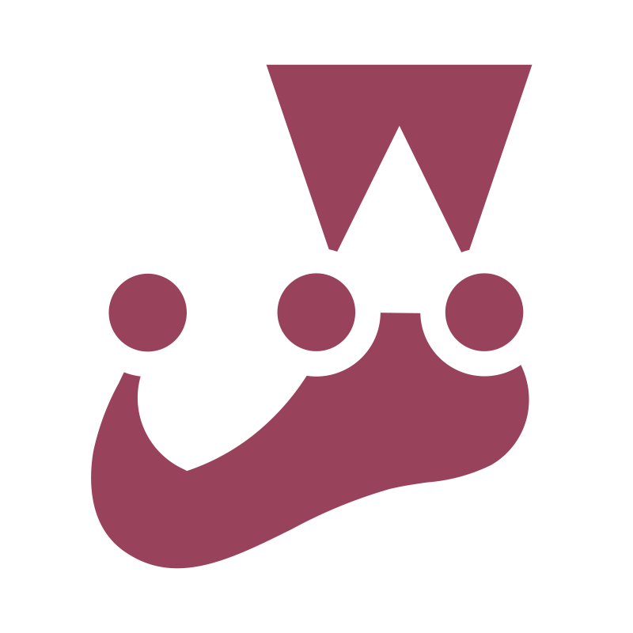

## 
Hi 👋, I'm Max

### 
 A passionate full stack developer based in Sydney 

 
### Languages and Tools

	
	
	
        
        
        
	
	
	
	
	
	
	
	
	
	
	
	
	
	

<!--
**chaoma6/chaoma6** is a ✨ _special_ ✨ repository because its `README.md` (this file) appears on your GitHub profile.

 

Here are some ideas to get you started:

- 🔭 I’m currently working on ...
- 🌱 I’m currently learning ...
- 👯 I’m looking to collaborate on ...
- 🤔 I’m looking for help with ...
- 💬 Ask me about ...
- 📫 How to reach me: ...
- 😄 Pronouns: ...
- ⚡ Fun fact: ...
-->
